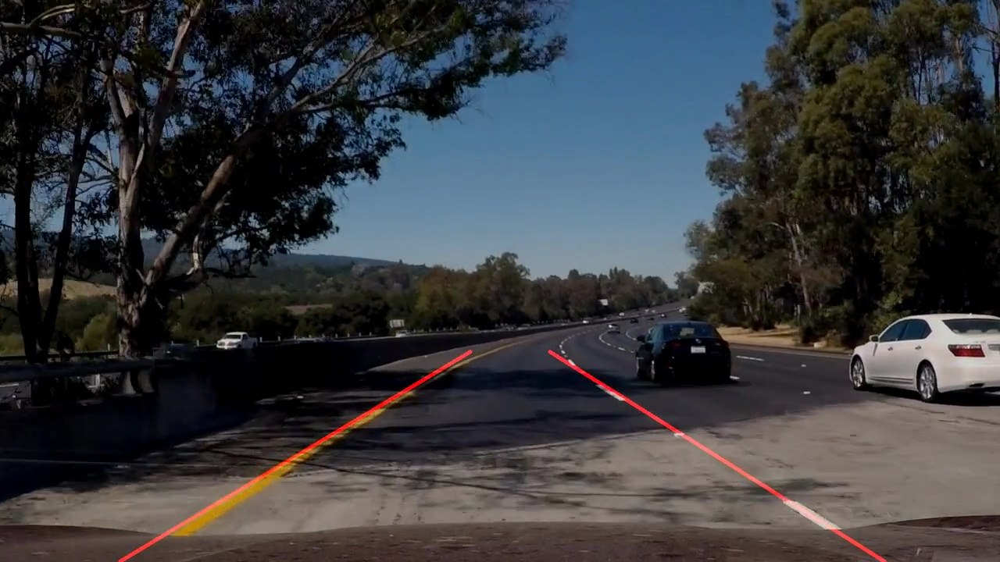

# **Finding Lane Lines on the Road** 

Overview
---

When we drive, we use our eyes to decide where to go.  The lines on the road that show us where the lanes are act as our constant reference for where to steer the vehicle.  Naturally, one of the first things we would like to do in developing a self-driving car is to automatically detect lane lines using an algorithm.

## Project: **Finding Lane Lines on the Road**
***
In this project, I use the tools we learned about in the lesson to identify lane lines on the road.  I developed a pipeline to find lane lines in an image, testing it on a series of individual images. Later the same pipeline is applied to video streams (processing frames as a series of images), while updating line parameters (slope and mid point of line) using moving averages to smoothen the lane lines in video.

All the code is in the P1.ipynb notebook and is also exported to a script file P1.py to run or debug easily. The main algorithm steps are in hough_lines method, which is called by find_lanes_pipeline method. The main parameters to be tuned are in the find_lanes_pipeline method.  

In the algorithm description below, steps where I have incorporated my changes are listed in _italics_.

### Algorithm

The pipeline for finding lane lines involves the following steps:

1. Detect edges in image:
    1. Convert image to grayscale
    2. Apply gaussian blur
    3. Use canny edge detector
2. Find one laneline with positive slope and one laneline with negative slope:
    1. Find line segments using Hough transform
    2. For each line segment:
        1. _ Calculate slope, and x coordinate corresponding to a fixed y coordinate 3/4 down from top  of image _
        2. _ If slope is outside certain thresholds, eliminate corresponding line segment from consideration _
        3. _ Classify line segments into slope positive or slope negative _
    3. For positive and negative slopes:
        1. _ Find average of slopes _
        2. _ Find average of x coordinates corresponding to the fixed y coordinate 3/4 down from top of image _
        3. _ Use the above two (slope and point on line) to extrapolate the line to a single lane line with end points corresponding to two fixed y coordinates: one slightly below center of image and second at bottom of image _
    4. Draw the lane lines on original image

### Results

The directory test_videos_output contains the results of the algorithm, with detected lanes overlaid on image frames of the videos.

* Because the dominant slope is found after eliminating
lines with slopes outside reasonable thresholds, it appears to detect lanes very reliably.
* I have also used the image size as part of parameters wherever I believe the parameters are
affected by the image size, so if the image size changes the algorithm is still supposed to
well.
* Due to moving average updates to the estimated lane parameters, in videos also the algorithm 
detects lanes that are stable under changes in shading / lighting of road, and responsive to fast turns.  
Below is one of the image frame from the lane finding result of the challenge video, which is particularly
difficult for any algorithm without moving average or some other form of smoothing across frames, 
due to shade from side-by trees and patches of different color on the road.

### Shortcomings

* Although the algorithm appears to work well even on the challenge video,
the algorithm is sensitive to the parameters used and there is no guarantee it
will work in untested scenarios.  For example, I have used low thresholds in edge detection to
ensure edges are detected even with low gradients, but there could be lane lines
even outside the range used, especially under different weather conditions.  
Same is true for line detection parameters used for
Hough transform.  Similarly, the lanes are assumed to have slope within certain
range, but these assumptions may not hold true under all circumstances.

* Another shortcoming is: the algorithm will try to find a
lane line even when there is no real lane line, as long as there are some edges
present with slope in the ranges used in the algorithm.

* Solution will not work in low light or at night, it is meant to be used for 
bright daylight conditions only.

* The algorithm assumes clear lane lines to be present always, which mat not be true:
    * In different regions of world, where the lane lines may be different colors, patterns
 or not even existing.  
    * Also under heavy traffic conditions within center of city,or where the traffic rules 
are not followed, it may be hard to detect lanes due to them being hidden by other 
vehicles moving closely or moving in and out of lanes frequently 
    * There may be situations where lanes markings may be overlaid or diverted 
under construction, where the lane finding becomes hard also.

### Possible improvements

This algorithm assumes clear conditions and lane lines present and can be detected easily.  
I have not attempted to address most shortcomings listed owing to violation of the above assumption.

However, I can still see some improvements in the algorithm as listed below:

* The parameter tuning is done mainly using test images, but it would be better to have a way
to determine algorithm parameters over large set of training images.
* I tried using line segment length or median of slopes to determine the dominant slope, but
my current method of limiting valid slope to a small range and using average within those worked
better than those.

